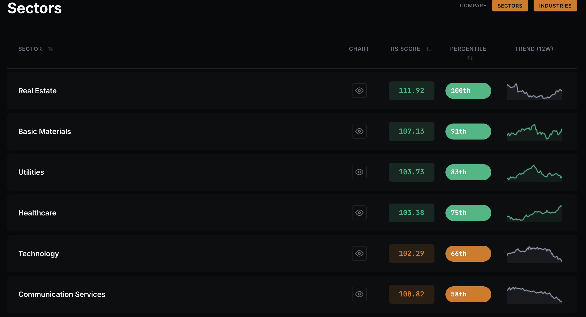
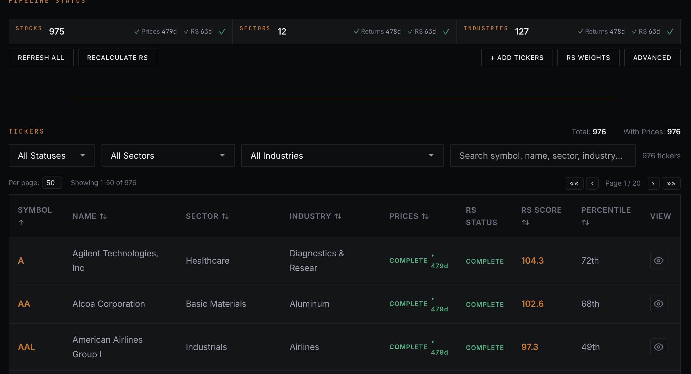
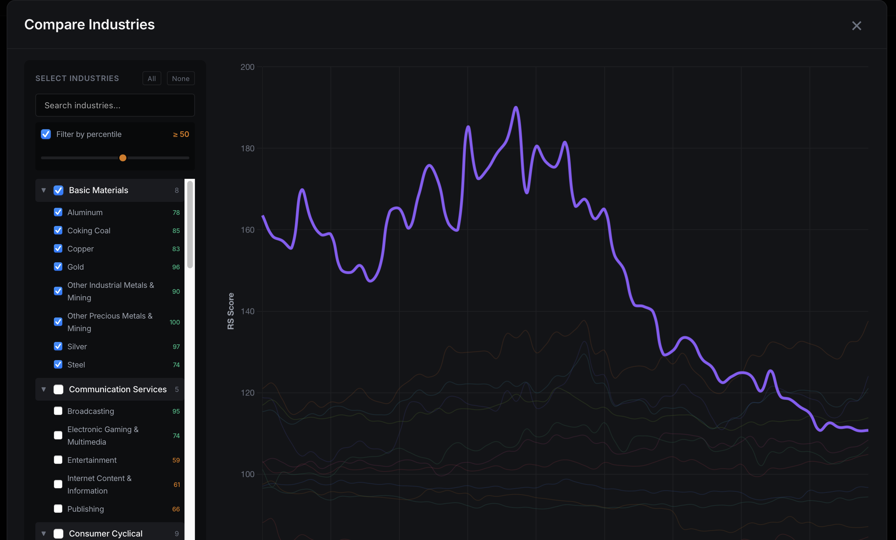

# RS Dashboard

A free, open-source Python application for tracking stock Relative Strength metrics. Analyze price data locally on your PC without expensive subscriptions.

## What It Does

RS Dashboard helps you:
- **Import tickers** from CSV with automatic sector/industry mapping
- **Fetch prices** from Yahoo Finance (1 year of daily data)
- **Calculate RS scores** against SPY benchmark
- **Analyze trends** by sector, industry, and individual stocks
- **View rankings** with 12-week sparklines and percentile data

## Key Features

- Free and open-source
- Runs locally on your PC (Mac & Windows)
- No subscriptions or API keys required
- Educational tool for learning market analysis
- Clean, dark-themed interface

## Quick Start

### Option 1: One-Click Run (Recommended)

**Mac/Linux:**
```bash
./run.sh
```

**Windows:**
```
run.bat
```

The script will automatically:
1. Install `uv` package manager (if needed)
2. Install all dependencies
3. Start the app at `http://localhost:5001`
4. Open your browser

### Option 2: Manual Setup

**Requirements:**
- Python 3.11+
- [uv](https://github.com/astral-sh/uv) package manager

**Steps:**

1. Clone the repository:
```bash
git clone https://github.com/thatfintechguy/rs-dashboard.git
cd rs-dashboard
```

2. Install dependencies with uv:
```bash
uv sync
```

3. Run the application:
```bash
uv run python -m uvicorn api.main:app --host 0.0.0.0 --port 5001
```

4. Open `http://localhost:5001` in your browser

## Screenshots

### Dashboard


### Data Manager


### Compare Tool


## Usage

### Dashboard Page (`/dashboard`)
- View sectors ranked by strength %
- Drill down into industries within each sector
- Click any sector/industry to see RS trend chart
- View individual stocks with OHLC + RS overlay charts

### Admin Page (`/admin`)
- Upload CSV with ticker symbols
- Monitor pipeline status (Stocks, Sectors, Industries)
- Refresh prices and recalculate RS scores
- Filter and sort ticker table
- Configure RS calculation weights (Q1-Q4 quarterly weights)

## How It Works

### 4-Step Pipeline

1. **Import** - CSV with tickers. Sectors and industries mapped automatically via Yahoo Finance.
2. **Fetch** - One year of daily OHLC prices. Stored locally in SQLite.
3. **Calculate** - RS score vs SPY. Percentile rank. Strength % by sector and industry.
4. **Analyze** - Drill down: Sector → Industry → Stock. 12-week trends. Sortable. Filterable.

### RS Score Calculation

Applied to **stocks, sectors, and industries**:

```
RS Score = (1 + Weighted Return) / (1 + Weighted Benchmark Return) × 100
```

Where:
- **Weighted Return** = Q1 Return × 40% + Q2 Return × 20% + Q3 Return × 20% + Q4 Return × 20%
- **Weighted Benchmark Return** = Same quarterly weighting applied to SPY

**Quarterly Periods (configurable in Admin):**
- Q1 (most recent 63 days): 40% weight
- Q2 (64-126 days): 20% weight
- Q3 (127-189 days): 20% weight
- Q4 (190-252 days): 20% weight

Higher scores indicate stronger relative performance vs SPY. Score of 100 = matching SPY performance.

### Strength % (Sectors/Industries)

```
Strength % = (Stocks with RS > 100) / Total Stocks × 100
```

Shows what percentage of stocks in a sector/industry are outperforming SPY.

## Project Structure

```
rs-metrics-app/
├── api/                    # FastAPI application
│   ├── main.py            # App entry point
│   ├── routes/            # API endpoints
│   └── services/          # Business logic
├── db/                     # Database module
│   └── db.py              # SQLite operations
├── calc-engine/           # RS calculation engine
│   ├── rs_calculator.py   # RS score computation
│   └── settings.py        # RS weights configuration
├── price-engine/          # Price fetching (yfinance)
│   └── yfinance_provider.py  # Yahoo Finance API with rate limiting
├── templates/             # Jinja2 HTML templates
│   ├── dashboard.html
│   ├── admin.html
│   └── partials/
├── pyproject.toml         # Dependencies
├── run.sh                 # Mac/Linux startup script
└── run.bat                # Windows startup script
```

## Data

- **Source**: Yahoo Finance (via yfinance library)
- **Storage**: Local SQLite database (`db/data/rs_metrics.db`)
- **Scope**: 1 year of daily OHLC price data per ticker
- **Rate Limiting**: Built-in throttling to avoid Yahoo Finance API limits
- **Caching**: Prices cached locally; only new days fetched on refresh

## Tech Stack

- **Backend**: FastAPI, Python 3.11+
- **Frontend**: HTMX, Alpine.js, Chart.js
- **Database**: SQLite
- **Package Manager**: uv

## Legal Disclaimer

**EDUCATIONAL TOOL ONLY. NOT INVESTMENT ADVICE. NO WARRANTIES OR GUARANTEES. USE AT YOUR OWN RISK.**

Open-source code provided as-is with no guarantee of accuracy, completeness, or fitness for any purpose. Data sourced by user from Yahoo Finance may be incomplete or inaccurate. User is solely responsible for downloading, setting up, and running this tool. Technical competency required. User assumes all risk and consequences. The creator assumes no liability for any losses or damages.

## Support

Enjoying RS Dashboard? Consider supporting development:

[](https://buymeacoffee.com/thatfintechguy)

## Contributing

Contributions welcome! Please:
1. Fork the repository
2. Create a feature branch
3. Submit a pull request

## License

MIT License - see LICENSE file for details

## Contact

Questions or ideas? [thatfintechguy@outlook.com](mailto:thatfintechguy@outlook.com)

---

*Expensive tools are pricing out retail traders and creating information asymmetry. RS Dashboard levels the playing field.*
